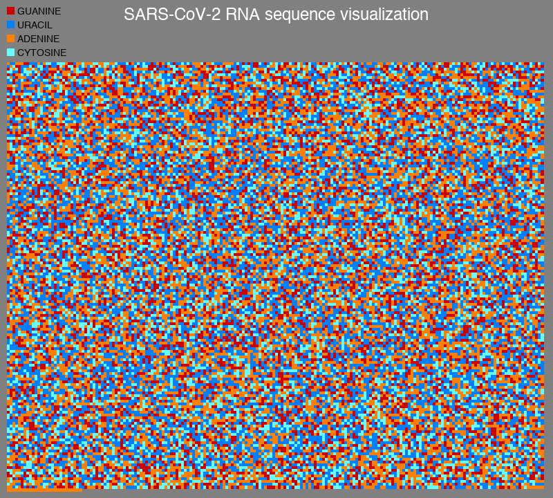

# SARS-CoV-2 RNA Sequence (Genome) Visualization
This is a very basic visualization of the SARS-CoV-2 RNA Sequence (Genome). The script creates an image using Python Image Library (PIL). Every base in the RNA molecule corresponds to a colour.
  
RNA Sequence source: [https://www.ncbi.nlm.nih.gov/nuccore/MN908947.3](https://www.ncbi.nlm.nih.gov/nuccore/MN908947.3)

Feel free to tweak the colors or resolution to your liking.

## How to run
```bash
$ pip3 install -r requirements.txt
$ python3 main.py
```

## Render
